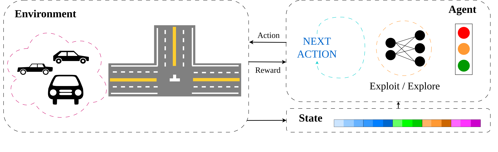
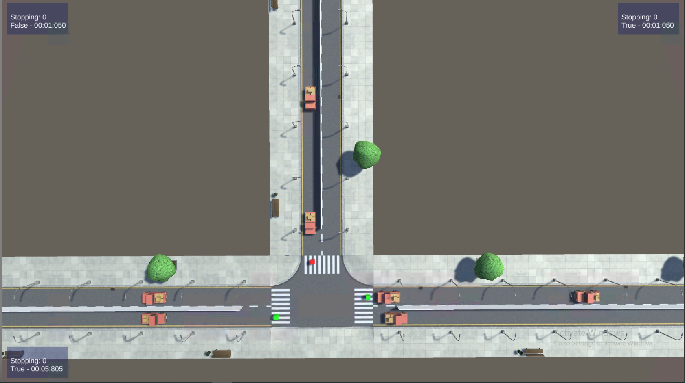
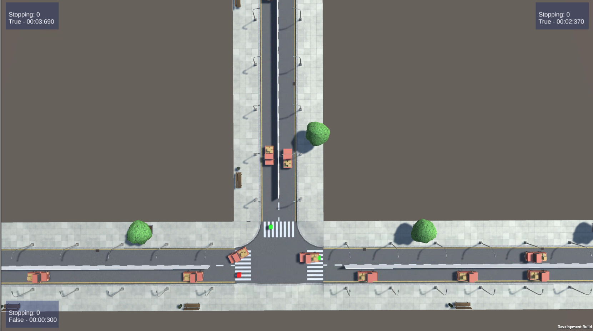
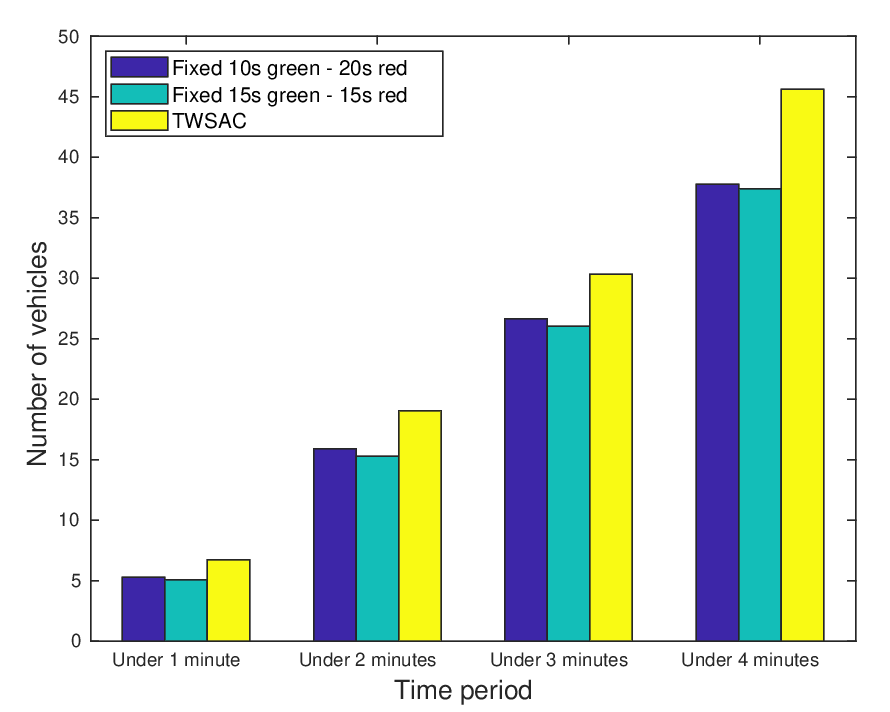
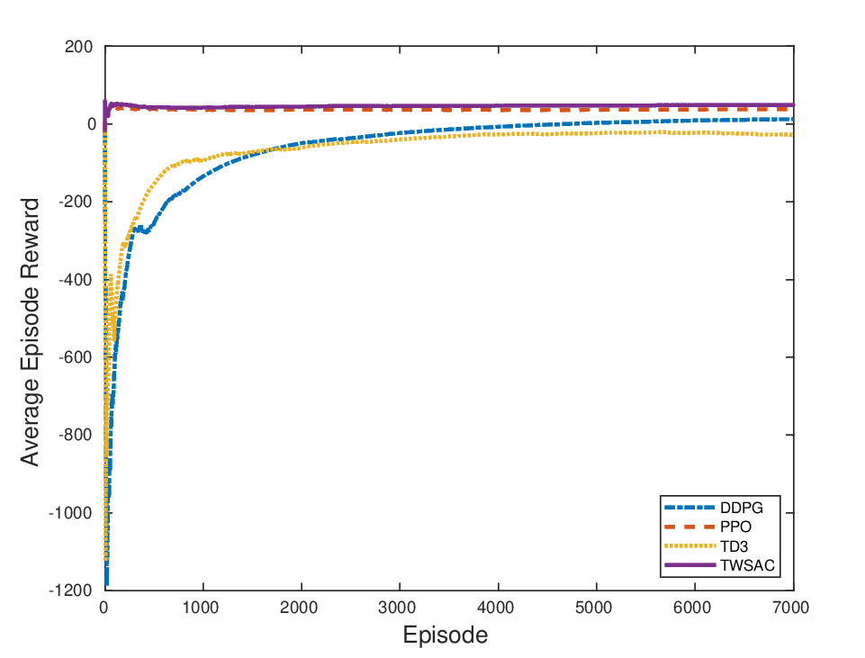

# Design of Deep Reinforcement Learning Approach for Traffic Signal Control at Three-way Crossroads

This repository presents the following article in Python:


Thanh Nguyen Canh, Anh Pham Tuan, Xiem HoangVan, "**Design of Deep Reinforcement Learning Approach for Traffic Signal Control at Three-way Crossroads**," *Under Review*. 
[[**Research** *Square*](https://www.researchsquare.com/article/rs-3128875/v1)] [[Citation](#citation)]

## Citation
```
@article{canh2023design,
  title={Design of Deep Reinforcement Learning Approach for Traffic Signal Control at Three-way Crossroads},
  author={Canh, Thanh Nguyen and Tuan, Anh Pham and HoangVan, Xiem},
  year={2023}
}
```

- [Overview](#overview)
- [Overview](#1-requirements)
- [2. Installation](#2-installation)
- [3. Design](#3-design)
- [4. Results](#3-results)
- [5. Branch](#5-branch)
- [6. Reference](#6-reference)

## Oveview
<p align="center"></p>

## 1. Requirements
- Unity: 2020.3.33f1
- ML-Agents: 0.28.0
- C#: 8.0
- Python: 3.9.6
- PyTorch: 1.12.1

## 2. Installation
```
git clone https://github.com/thanhnguyencanh/DRL4Three-wayTSC
cd DRL4Three-wayTSC
pip3 install -r requirement.txt
```

## 3. Design
- Environment for testing Reinforcement Learning algorithms.
- Properties:

    | Property | Detail  |
    | -------- | --------|
    | Action Space | Discrete(8) |
    | Observation Shape | (12,)  |

    Observation space includes:
    - Waiting time of vehicles.
    - Speed of first car on each lane.
    - Timer for green lights.
    - Current state of traffic lights.

- Can be used for testing external algorithms or ML-Agents built-in algorithms.
- Includes built-in debug logs when using executable.


## 4. Results

| Scenario 1 | Scenario 2 |
| :---:      |     :---:  |
|  |  |
|  |  |


## 5. Branch
There are 2 branches for 2 versions of the environment:
- Reinforcement Learning: https://github.com/Spencer266/T-Juntion/tree/multi
- Fixed-time: https://github.com/Spencer266/T-Juntion/tree/linear

**Note**: The second one is used for comparing Reinforcement Learning and Fixed-time method. However, it can acts as a standalone own project.

## 6. Reference
- ML-Agents: https://github.com/Unity-Technologies/ml-agents
